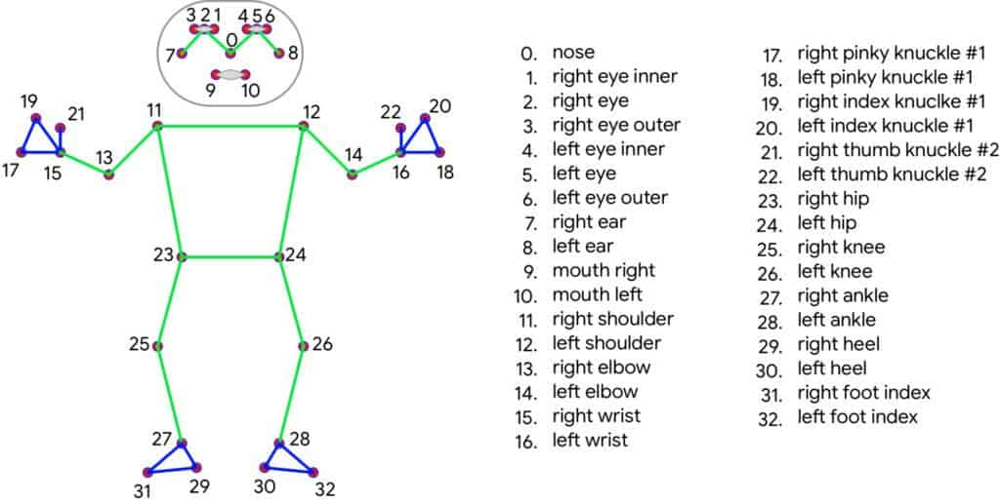
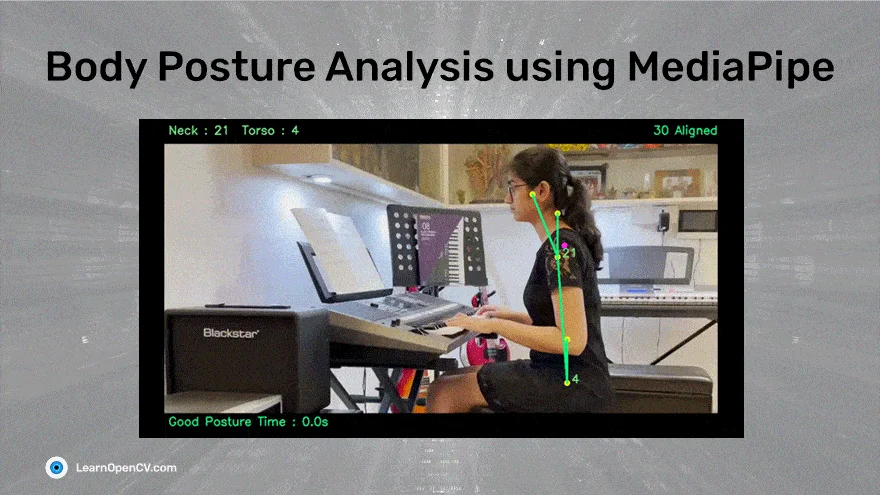
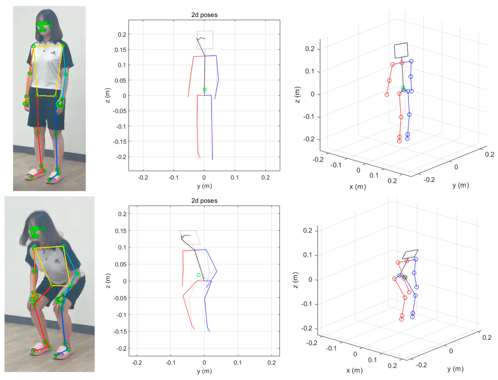
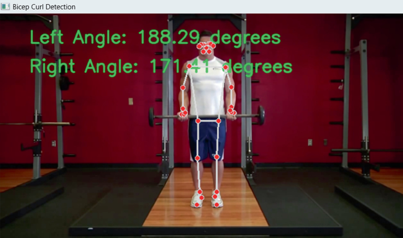
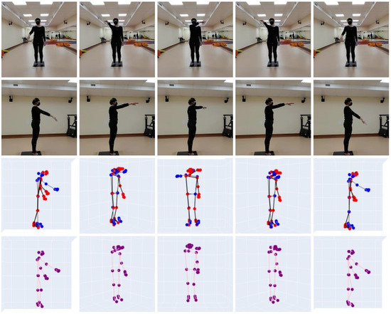
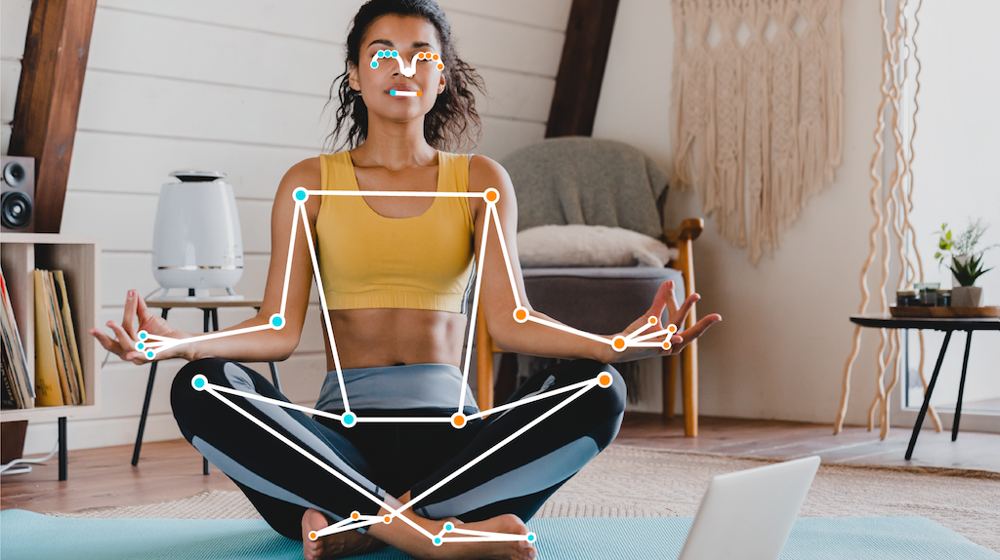

AI Intern ── Exercise Form Detection

This project implements a pose-estimation-based pipeline to detect exercise form correctness using **MediaPipe** (default), **OpenPose**, or any compatible human-pose model.

It includes:

* Pose keypoint extraction
* Angle computation
* Rule-based posture evaluation
* Real-time feedback overlay on video
* Optional MLflow integration

<p align="center">
  
</p>

<p align="center">
  
</p>

---

## Project Structure

```
AI-Intern-Exercise-Form-Detection/
│
├── README.md
├── requirements.txt
├── .gitignore
│
├── src/
│   ├── pose_detection/
│   │   ├── mediapipe_detector.py
│   │   ├── openpose_detector.py
│   │   └── utils.py
│   │
│   ├── form_evaluation/
│   │   ├── bicep_curl_rules.py
│   │   ├── lateral_raise_rules.py
│   │   ├── posture_rules.py
│   │   └── rule_engine.py
│   │
│   ├── visualization/
│   │   ├── overlay.py
│   │   └── smoothing.py
│   │
│   ├── mlflow_tracking/
│   │   └── mlflow_logger.py
│   │
│   └── main.py
│
├── scripts/
│   ├── extract_keypoints.py
│   ├── evaluate_video.py
│   └── generate_demo_video.py
│
├── notebooks/
│   ├── exploratory_pose.ipynb
│   └── angle_calculation_tests.ipynb
│
├── data/
│   ├── raw/
│   │   ├── coco2017/
│   │   ├── mpii/
│   │   ├── fitness_dataset/
│   │   └── youtube_videos/
│   │
│   ├── processed/
│   └── keypoints/
│
├── output/
│   ├── results/
│   ├── overlays/
│   ├── logs/
│   └── mlflow/
│
└── docs/
    ├── Report.pdf
    └── posture_rules_explained.md
```

---

## Features

### Pose Estimation

Uses **MediaPipe** (default) or **OpenPose** to extract:

* **33 keypoints** (MediaPipe)
* **18 keypoints** (OpenPose)

Supports real-time and offline video processing.

---

### Angle Computation

Joint angles (e.g., elbow flexion, shoulder abduction) are calculated using the **vector dot product** method.

<p align="center">
  
</p>

---

### Form Evaluation Rules

Exercise-specific **rule-based** posture checks:

* **Bicep Curl**

  * Elbow flexion angle range
  * Upper-arm stability

* **Lateral Raise**

  * Shoulder abduction/elevation
  * Wrist–shoulder horizontal alignment

* **Posture Correction**

  * Spine straightness
  * Shoulder symmetry
  * Forward head / slouch detection

#### Bicep Curl Detection Example

<p align="center">
  
</p>

#### Lateral Raise Detection Example

<p align="center">
  
</p>

#### Posture Correction Example

<p align="center">
  
</p>

---

### Keypoint Smoothing

Reduces pose jitter using:

* Moving Average Filter
* Savitzky–Golay Filter

---

### Real-Time Feedback

Generates annotated videos with:

* Neon skeleton overlay
* Live joint angle display
* **Correct (Green)** / **Incorrect (Red)** feedback labels


---

## How to Run

### Step 1: Install Dependencies

```bash
pip install -r requirements.txt
```

### Step 2: Run the Pipeline

```bash
python src/main.py --video data/raw/youtube_videos/your_exercise_video.mp4
```

### Step 3: View Output

Annotated videos are saved in:

```
output/overlays/
```

---

## Dataset

### Primary Dataset (Main Pipeline)

YouTube exercise tutorial videos:

* **Bicep_Curl_Workout_Tutorial.mp4** → Bicep Curl evaluation
* **Lateral_Raise_Tutorial.mp4** → Lateral Raise evaluation
* **Shoulder_Posture_Correction.mp4** → Posture & back alignment evaluation

These videos were selected for:

* Clear upper-body visibility
* Professional demonstration of correct form

---

### Additional Datasets (Validation & Testing)

Used mainly in notebooks:

* **COCO 2017** — Pose consistency validation
* **MPII Human Pose** — Angle calculation testing
* **Kaggle Fitness Dataset** — Exploratory analysis

---

## Submission Includes

* Full Python source code (clean, modular architecture)
* Annotated demo videos with real-time feedback (`output/overlays/`)
* Detailed project report (`docs/Report.pdf`)
* Posture rules explanation (`docs/posture_rules_explained.md`)
* Evaluation results and accuracy proof (`output/results/`)
* Jupyter notebooks for angle testing and exploration

---

## Author

**Jyothir Raghavalu Bhogi**
**Date:** December 2025

**Submitted for:**
Smartan Fitech Private Limited — Computer Vision & AI Internship Task

**GitHub Repository:**
[https://github.com/jyothir-369/AI-Intern-Exercise-Form-Detection](https://github.com/jyothir-369/AI-Intern-Exercise-Form-Detection)
